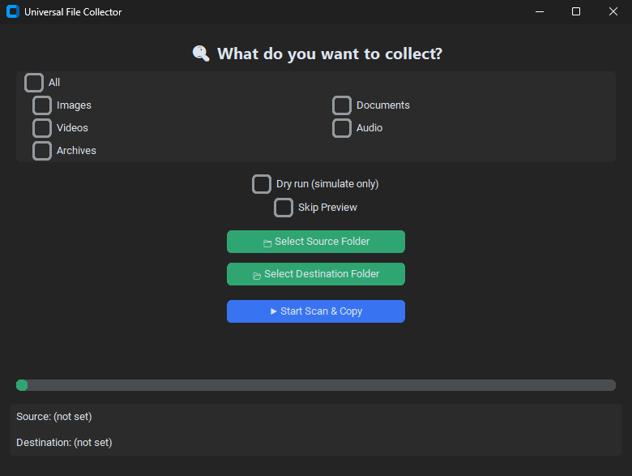

# Universal File Collector (GUI)


Cross-platform GUI to automatically sort and de-duplicate your media and documents in minutes.
One click to scan, preview, and organize into clean, dated folders.



## Why this tool exists

- Folders with mixed photos, docs, and downloads quickly become chaos.
- Different dates and formats make it hard to find anything later.
- Manual deduplication is slow and error-prone.

## Features

- Recursive scan of source folder.
- Category filtering: `Images`, `Documents`, `Videos`, `Audio`, `Archives`, `All`.
- Organization by `<Category>_<YYYY-MM-DD>`.
- Duplicate content detection via SHA-256.
- Duplicate file renaming with `_dup` suffix (no overwrites).
- Optional preview step before copy.
- Dry-run mode with no filesystem writes to destination.
- Preflight disk-space check before real copy operation.
- Run summary in GUI and persistent `log.txt` for real runs.

## Supported formats

- `Images`: `.jpg`, `.jpeg`, `.png`, `.gif`, `.bmp`, `.tiff`, `.webp`
- `Documents`: `.pdf`, `.docx`, `.txt`, `.xlsx`, `.csv`, `.pptx`
- `Videos`: `.mp4`, `.mov`, `.avi`, `.mkv`, `.3gp`, `.wmv`, `.m4v`
- `Audio`: `.mp3`, `.wav`, `.m4a`, `.ogg`, `.flac`, `.aac`
- `Archives`: `.zip`, `.rar`, `.7z`, `.tar`, `.gz`, `.iso`

Unknown extensions are categorized as `OTHER` when `All` is selected.

## Dry run behavior

When `Dry run (simulate only)` is enabled:

- no files are copied,
- destination subfolders are not created,
- `log.txt` is not written,
- summary is still displayed in GUI.

## Installation and run

### For users (no Python setup)

- Download the latest release from GitHub: [Latest Release](https://github.com/draprar/tkinter-image-collector/releases/latest)
- Run the executable for your OS.

Supported OS: Windows, macOS, Linux

### For developers

Create and activate virtual environment (Windows PowerShell):

```powershell
python -m venv venv
.\venv\Scripts\Activate.ps1
```

Install dependencies:

```powershell
pip install -r requirements.txt
```

Run app:

```powershell
python main.py
```

## Usage

1. Select a source folder to scan.
2. Select a destination folder for output.
3. Pick categories (or All), then click Start.

Optional: enable Dry run to simulate, or Preview to inspect before copy.

## Output structure

After selecting destination folder in GUI, app creates a run directory like:

`COLLECTED_FILES_2026-04-08_12-30-00`

Inside it:

```
COLLECTED_FILES_2026-04-08_12-30-00/
├── Images_2024-12-01/
│   ├── photo_001.jpg
│   ├── photo_002_dup.jpg
├── Documents_2023-10-05/
└── log.txt
```

## Quality checks

```powershell
pytest -q
ruff check .
mypy core.py ui.py main.py
python -m bandit -q core.py ui.py main.py
pip-audit -r requirements-runtime.txt
```

Optional local hooks:

```powershell
pre-commit install
pre-commit run --all-files
```

## Roadmap

- Parallel scanning for faster large directory processing.
- More granular category presets (custom filters).
- Optional CSV export of run summary.

## Security

If you discover a security issue, please report it privately (see `SECURITY.md`).

## Contributing

See `CONTRIBUTING.md` for development setup and PR guidelines.

## Author

Developed by Walery ([@draprar](https://github.com/draprar/))
